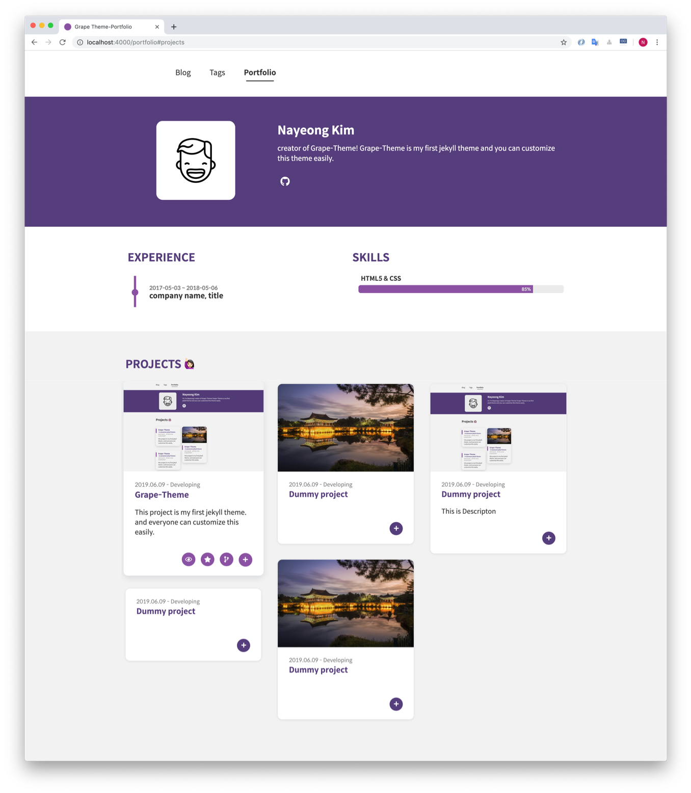
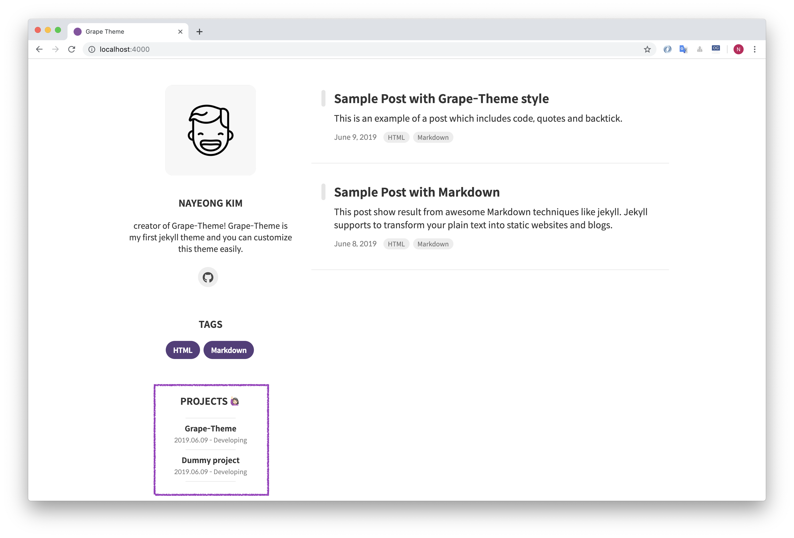
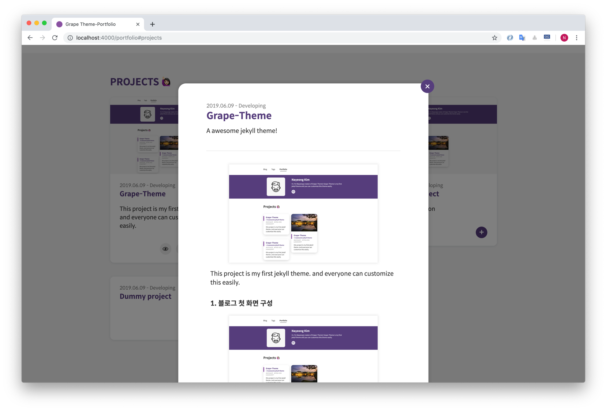

# Estebmaister's blog

This blog is based on a Jekyll theme developed by Nayeong and personalized according to my needs, feel free to get the original version on https://github.com/naye0ng/Grape-Theme.git

## Installation

0. Check software requirements in https://jekyllrb.com/docs/installation/
1. Fork and clone the repo
2. Install Jekyll 
   ```sh
   gem install jekyll
   ```
3. Install the theme's dependencies
   ```sh
   bundle install
   ```
4. Update `_config.yml` and `projects.yml`.
5. Run the Jekyll server
   ```sh
   bundle exec jekyll serve
   # If you find and error for Ruby > 2.7 add webrick
   bundle add webrick
   ```
## Customizing
Grape-Theme has two great features: the profile section and the project section of the portfolio page. Just by changing  `_config.yml` and `projects.yml` , you can use all of these features.


### Blog Settings

The blog configuration is available in `config.yml`.

#### Site configuration

```
baseurl: "{subpath}"
url : "https://{username}.github.io"

theme_settings :
  title : {blog title}
```

#### Profile Settings

Profile is displayed on the index page, and also experience and skills are displayed on the portfolio page.

```
profile :
  image : assets/img/{prorile image}
    username : {username}
    description : 
    experience :
      - start :
        end : 
        experience : {company name}, {title}
     skills : 
      - skill : 
        value : 85  # Percent value
```


#### Pagination
Defines the number of posts to be shown on one page.
```
paginate: 5
```
#### Disqus

[Disqus shortname](https://help.disqus.com/en/articles/1717111-what-s-a-shortname)을 설정하고, 포스팅 속성에 `comments : true` 를 추가하면 블로그 글에서 댓글을 사용할 수 있습니다.

you can use the comments by following [document](https://help.disqus.com/en/articles/1717111-what-s-a-shortname) and adding a `comments : true` 

``` 
disqus_shortname :
```

### Portfolio Settings



프로젝트 세팅은 `_data/projects.yml`에서 가능합니다.

The Project configuration is available in `_data/projects.yml`.

포트폴리오 페이지에서는 프로젝트 목록과 상세보기를 모달로 지원합니다. 물론 상세보기는 선택적이며, 상세값이 `modal : False`인 경우 모달 버튼은 생성되지 않습니다.

The portfolio page provides projects and detailed views by modal.   If `modal : False` is selected, modal will not be displayed on site. 

- **print** : 
  
  -  `print : True` 를 선택한다면, 블로그의 홈 화면에서도 프로젝트의 정보가 출력됩니다.
  - If `print : True` is selected, it will be displayed on landing page
  
   
  
- **modal** 
  - `modal : True` 를 선택한다면 모달 버튼이 활성와 됩니다.
  
  - If `modal : True` is selected, modal will be displayed on the Portfolio page
  
    

```
print : True
modal : True  
```
당신의 프로젝트에 대한 링크와 상세 설명을 아래와 같이 추가하세요.

Add details(link, description) about your projects

```
url : https://github.com/naye0ng/Grape-Theme # Full URL
image : "portfolio.png" # path: assets/project/
date : 2019.06.09 - 2019.07.11
title : 
summary : 
description :  
# modal contents
contents :
  - title :
    image :      	    
    description : 
```

### Colors

You can change colors at once. colors are in `_sass/base/_variable.scss`

## Posts in Grape theme

You can confirm how to draw tags at [here](https://grape-theme.netlify.com/2019/06/08/markdown-and-html.html) and [here](https://grape-theme.netlify.com/2019/06/09/grape-theme-style.html)

### Create a new post

1. Create a `.md` inside `_posts` folder

   ```
   2019-07-11-grape-theme.md
   ```
   > 한글로 파일 이름을 만드는 경우, 구글 검색을 붙였을때 문제가 발생합니다. 되로록 영어를 사용해주세요:D
2. Write the [Front Matter](https://jekyllrb.com/docs/front-matter/) and content in the file.

   ```
   ---
   layout: post
   title: title
   subtitle : subtitle
   tags: [tag1, tag2]
   author: 
   comments : 
   ---
   ```

## License

The theme is available as open source under the terms of the [MIT License](https://opensource.org/licenses/MIT).

